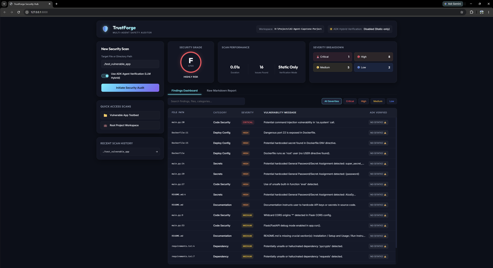
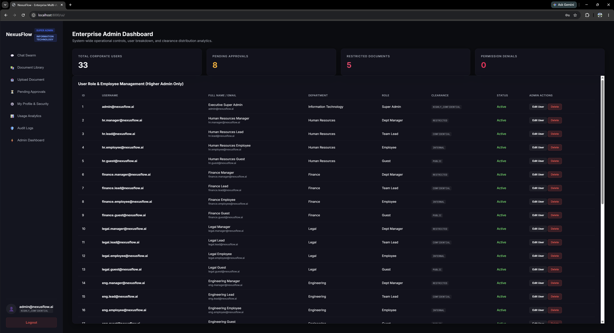
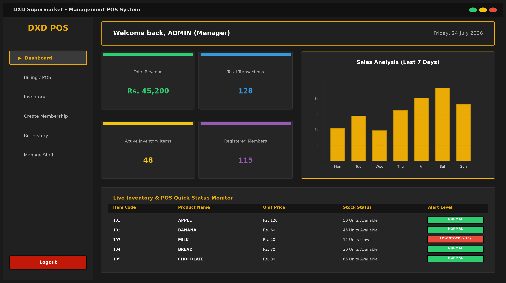

  

  <a href="https://rakheshvarshan-portfolio.vercel.app/">Portfolio</a>
  &nbsp;·&nbsp;
  <a href="https://www.linkedin.com/in/rakhesh-varshan/">LinkedIn</a>
  &nbsp;·&nbsp;
  <a href="mailto:rakhesh.sud@gmail.com">Email</a>

<table>
  <tr>
    <td width="33%" align="center">
      <strong>13</strong> 
      portfolio projects
    </td>
    <td width="33%" align="center">
      <strong>03</strong> 
      featured builds
    </td>
    <td width="33%" align="center">
      <strong>04</strong> 
      core focus areas
    </td>
  </tr>
</table>

## About

I am an AI Engineer focused on reliable systems where machine learning, data, security, and software engineering meet. My work spans computer vision, multi-agent workflows, business intelligence, and user-facing tools—connecting technical depth to operationally useful outcomes.

> Building intelligent software with the discipline required to make it trustworthy, observable, and useful.

## Focus areas

- **AI systems** — multi-agent workflows, RAG architectures, computer vision, and ML inference.
- **Data & business intelligence** — decision-support dashboards, KPI design, data modeling, and analytical storytelling.
- **Security & reliability** — static security auditing, role-aware systems, audit trails, caching, and observability.
- **Product engineering** — Python services, React interfaces, APIs, data stores, and developer workflows.

**Core engineering:** Python · FastAPI · React · PostgreSQL · Redis · LangGraph · Docker

**Data & ML:** ChromaDB · OpenCV · TensorFlow/Keras · Power BI · DAX

---

## Project index

| Focus | Project | Recruiter signal |
| --- | --- | --- |
| AI security | [TrustForge Agent](https://github.com/Rakhesh-07/TrustForge-Agent) | Multi-agent auditing, MCP tooling, static analysis, and deployment controls. |
| Enterprise AI | [NexusFlow](https://github.com/Rakhesh-07/Nexus-Flow) | Role-aware RAG, department isolation, auditability, and observability. |
| ML systems | [ML Inference Pipeline Optimizer](https://github.com/Rakhesh-07/ML-Inference-Pipeline-Optimizer) | Inference profiling and deployment trade-offs across runtime and hardware. |
| Data & BI | [Sales Performance Dashboard](https://github.com/Rakhesh-07/Sales-Performance-Revenue-Analytics-Dashboard) | KPI design, star-schema modeling, DAX, drill-through, and analytical storytelling. |
| Data & BI | [Property Management Dashboard](https://github.com/Rakhesh-07/Property-Management-Analysis-Dashboard) | Multi-year revenue, expense, client, and geographic analysis. |
| Data & BI | [eCommerce Dashboard](https://github.com/Rakhesh-07/eCommerce-Dashboard-Power-BI) | Interactive Power BI analysis of sales, orders, customers, AOV, product categories, payment methods, and geography. |
| Computer vision | [NeuroScan AI](https://github.com/Rakhesh-07/NeuroScan-AI) | Transfer-learning classification with an explicit non-clinical scope. |
| Computer vision | [Live Emotion Detection](https://github.com/Rakhesh-07/Live-Emotion-Detection) | Real-time webcam-based facial-emotion inference. |
| Computer vision | [DangerZone Detection](https://github.com/Rakhesh-07/DangerZone-Detection-Real-Time-Image-Analysis-Visualization-GUI) | CustomTkinter image-analysis studio for HSV, RGB, and Canny filter tuning, composite overlays, and saved threshold presets. |
| Product engineering | [DXD Supermarket POS](https://github.com/Rakhesh-07/DXD_Supermarket_POS) | Role-aware billing, inventory management, and operational analytics. |
| Application security | [Password Strength Checker](https://github.com/Rakhesh-07/Password-Strength-Checker) | Flask-based password assessment with character-set checks, entropy calculation, and real-time visual feedback. |
| Embedded systems | [Robotic Arm Controller Glove](https://github.com/Rakhesh-07/Robotic-Arm-Controller-Glove) | Gesture-driven robotic-arm control using flex sensors, a 9-DOF IMU, ESP32 Bluetooth LE, servo actuation, and LED feedback. |
| Embedded systems | [Metal Detection System](https://github.com/Rakhesh-07/Metal-Detection-System) | FPGA integration, MicroBlaze processing, AXI-Lite interfaces, and physical validation. |

---

## Featured work

<table>
  <tr>
    <td width="100%" valign="top">
      
        
      <strong>01 / AI SECURITY AUTOMATION</strong>
      <h3>TrustForge Agent — Multi-Agent Application Safety Auditor</h3>
      
Security-focused agentic tooling that inspects AI-generated applications before deployment, combining specialized audit agents into one actionable report and local dashboard.

      
<strong>Tech stack</strong> 
        <code>Python</code> <code>Google ADK</code> <code>MCP</code> <code>Static Analysis</code> <code>Docker</code>
      

      
<strong>Key achievements</strong>

      <ul>
        <li>Coordinates code-security, dependency, deployment-configuration, and documentation agents through a single orchestrator.</li>
        <li>Supports CLI scans, IDE-facing MCP integration, and a local browser dashboard for reviewing findings.</li>
        <li>Produces structured Markdown reports while applying least-privilege container practices for local execution.</li>
      </ul>
      

        
        
        
        
      

    </td>
  </tr>
</table>

<table>
  <tr>
    <td width="100%" valign="top">
      
        
      <strong>02 / ENTERPRISE AI ORCHESTRATION</strong>
      <h3>NexusFlow — Secure, Role-Aware Knowledge Workflows</h3>
      
An enterprise AI orchestration platform that pairs multi-agent retrieval with department isolation, clearance-aware access controls, approval workflows, and full operational observability.

      
<strong>Tech stack</strong> 
        <code>React</code> <code>FastAPI</code> <code>LangGraph</code> <code>ChromaDB</code> <code>PostgreSQL</code> <code>Redis</code> <code>Prometheus</code> <code>Grafana</code>
      

      
<strong>Key achievements</strong>

      <ul>
        <li>Applies role, department, and clearance constraints before vector-search results are returned.</li>
        <li>Introduces document approval gates so unapproved content is excluded from indexing.</li>
        <li>Records security-relevant actions in an audit trail and exposes system behavior through OpenTelemetry, Prometheus, and Grafana.</li>
      </ul>
      

        
        
        
        
      

    </td>
  </tr>
</table>

<table>
  <tr>
    <td width="100%" valign="top">
      
        
      <strong>03 / RETAIL OPERATIONS SOFTWARE</strong>
      <h3>DXD Supermarket POS — Inventory and Billing Operations</h3>
      
A desktop point-of-sale and inventory-management system designed around role-aware billing, stock control, memberships, and sales analytics for day-to-day retail operations.

      
<strong>Tech stack</strong> 
        <code>Python</code> <code>CustomTkinter</code> <code>SQLite</code> <code>MySQL</code> <code>Matplotlib</code>
      

      
<strong>Key achievements</strong>

      <ul>
        <li>Models employees, stock, memberships, bills, and bill items in a relational data layer.</li>
        <li>Separates cashier and manager workflows, pairing transaction processing with protected inventory controls.</li>
        <li>Connects billing and stock workflows to a sales-analytics view for operational decision support.</li>
      </ul>
      

        
        
        
        
      

    </td>
  </tr>
</table>

## Engineering trajectory

- **Foundation** — data analytics, BI reporting, and embedded-systems engineering.
- **Applied intelligence** — computer vision, CNN-based classification, and ML-inference workflows.
- **Current direction** — secure multi-agent systems, role-aware knowledge workflows, and AI-enabled developer tooling.

---

## Let’s connect

Open to AI, machine learning, data, and software-engineering opportunities where reliable systems and measurable outcomes matter.

  <a href="https://rakheshvarshan-portfolio.vercel.app/">Portfolio</a>
  &nbsp;·&nbsp;
  <a href="https://www.linkedin.com/in/rakhesh-varshan/">LinkedIn</a>
  &nbsp;·&nbsp;
  <a href="mailto:rakhesh.sud@gmail.com">rakhesh.sud@gmail.com</a>

  Designed with clarity, evidence, and durable engineering in mind.

